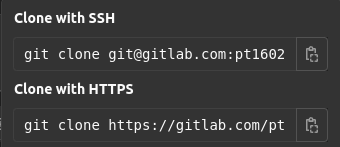
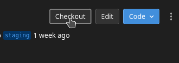

---

# GL "git clone …"

Simple Google Chrome extension which adds some minor tweaks to make working with Gitlab a little easier (for me).

---

## Current Features

It adds "git clone" before the repository source.

and also a _Checkout_ button on the Merge-Request page to copy the branch name plus a _git fetch && git checkout_ before and _git pull_ after it.

---

## Installation

### Install via Google Chrome web store

* Open [this link](https://chrome.google.com/webstore/detail/gl-git-clone/niofneadkfofccgnfmofgpbppfhbkgmg) to get to the extension page in the Google Chrome web store
* Click on _Add to chrome_

### Install via _developer mode_

* Download the [zip](https://github.com/pt1602/gl-git-clone/archive/refs/heads/main.zip) and unzip it or clone this repo
* Open chrome extensions _chrome://extensions/_ in your browser and enable the developer mode on the top right.
* Upload the unpacked extension

---

